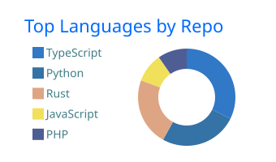

# albert-einshutoin

**English** | [日本語](./README.ja.md)

### Backend engineer turning production problems and ideas about what comes next into OSS.

I follow problems, not layers. If an idea could move technology forward and I can test it in code, I want to build it.

AI-assisted development lets me explore a wider range of systems. The goal is not just to generate code, but to understand what runs beneath it. I publish what I learn as open-source tools, and I want to carry the same ideas into web services and apps so more people can access emerging technology.

---

## Name and inspiration

> "Imagination is more important than knowledge."
>
> — Albert Einstein

`albert-einshutoin` is a small homage to Albert Einstein, the person I respect most. For me, imagination is the starting point; engineering is how I test it in the real world.

---

## How I build

1. Start with a concrete problem from production or development.
2. Question whether the problem is being solved at the right layer and whether the current abstraction still makes sense.
3. Form a technical hypothesis and test it in working software.
4. Publish the result as OSS so others can inspect, challenge, and extend it.

I am currently exploring programmable edge computing, native performance, safe local and CI infrastructure, and AI memory systems. These are areas I am exploring now, not boundaries around what I build.

---

## Selected work

### Programmable edge computing

- [**cdn-security-framework**](https://github.com/albert-einshutoin/cdn-security-framework) — `Released` `JavaScript`

  Born from production work with WAFs, application-level rate limits, and Nginx. It explores how lightweight filtering in Edge Functions and protection in a WAF can work as separate layers to reduce obvious anomalies before traffic reaches the backend.

- [**quant-cache**](https://github.com/albert-einshutoin/quant-cache) — `Released` `Rust`

  Built to explore whether offline QUBO and simulated-annealing search can improve CDN cache-policy selection under economic and capacity constraints.

- [**TenantScript**](https://github.com/albert-einshutoin/TenantScript) — `In progress` `TypeScript`

  Builds a control plane around Cloudflare Workers primitives for tenant-specific plugins, permissions, approvals, versioning, and audit logs. Live validation with Dynamic Workers is still in progress.

### Native performance

- [**lazy-image**](https://github.com/albert-einshutoin/lazy-image) — `Released` `Rust` `Node.js`

  Started after I chose `sharp` for image processing in a production Node.js system. Maturity and performance explain why an engine becomes the default—but could a new engine earn its place through different strengths? Image processing was a new domain for me, so I used AI-assisted development to explore bounded memory, secure defaults, and smaller JPEG outputs in the current reference benchmarks with a Rust-powered Node.js engine.

- [**i18next-turbo**](https://github.com/albert-einshutoin/i18next-turbo) — `Released` `Rust` `N-API`

  Started from wanting the fastest possible i18n checks in CI. Rust and SWC accelerate key extraction, while N-API keeps the native implementation accessible from the existing Node.js workflow.

### Safe local and CI infrastructure

- [**mockport**](https://github.com/albert-einshutoin/mockport) — `MVP` `Go` `Docker`

  Started with a practical question in AI-assisted development: how can agents run integration tests without reading `.env` or receiving production-like secrets? Instead of only changing how credentials are passed around, `mockport` emulates dependencies locally so tests can switch endpoints and environment variables.

- [**roomci**](https://github.com/albert-einshutoin/roomci) — `Experimental` `Rust` `MQTT`

  Grew from contributing to `floci` and building `mockport`. It explores whether local emulation and contract testing can reproduce IoT and smart-home failures in CI instead of waiting for them to happen in the field.

### AI memory systems

- [**qzt**](https://github.com/albert-einshutoin/qzt) — `In progress` `Rust` `zstd`

  `qzt` is a queryable zstd text-evidence container with partial retrieval and verified search. I am exploring it as a storage foundation for MemoryPager, a higher-level system for preserving and recovering long-running human–AI context.

---

## Upstream contributions

- [**floci**](https://github.com/floci-io/floci) — Local AWS RDS persistence and runtime restoration

  Merged: [#945](https://github.com/floci-io/floci/pull/945), [#1014](https://github.com/floci-io/floci/pull/1014), [#1071](https://github.com/floci-io/floci/pull/1071)

---

## Activity

  

---

## Contact

- [X / @forte_grapher](https://x.com/forte_grapher)
- [Note / albert_forte](https://note.com/albert_forte)
